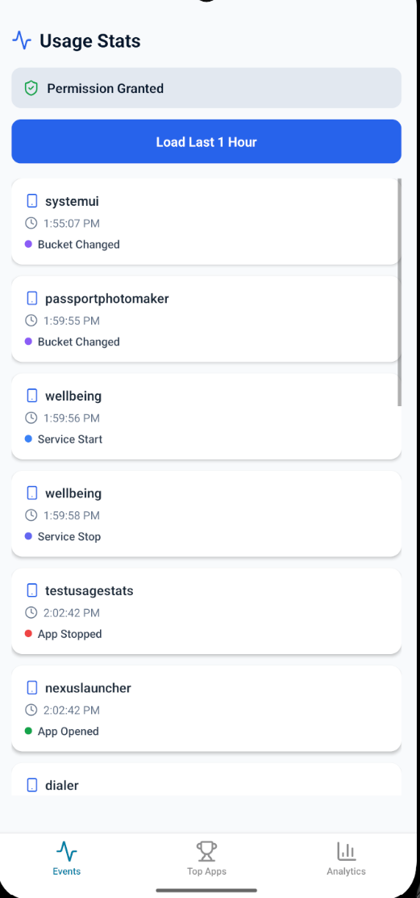
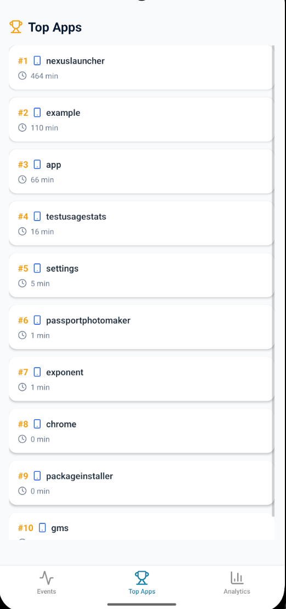
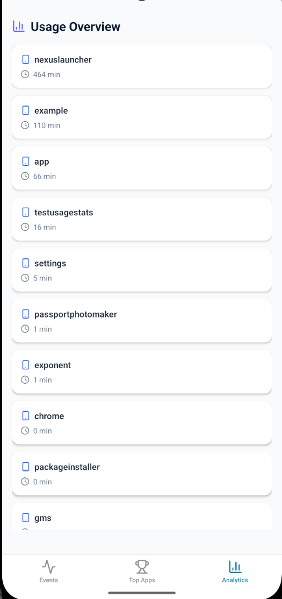

# @antar/react-native-usage-stats

Lightweight and fully-typed Android UsageStats API for React Native and Expo.

> Access app usage, events, standby buckets, and more — directly from Android's native APIs.

---

## ✨ Features

- Full `UsageStatsManager` coverage
- Typed API (TypeScript)
- Works with Expo (via custom dev client)
- Zero dependencies
- Non-opinionated (low-level primitives)

---

## 📦 Installation

```bash
npm install @antar/react-native-usage-stats
```

---

## ⚠️ Expo Support

This package requires a **custom development build**.

❌ Not supported in Expo Go
✅ Works with `expo prebuild` or bare React Native

To use with Expo:

```bash
npx expo prebuild
npx expo run:android
```

---

## ⚠️ Platform Support

- ✅ Android
- ❌ iOS (not supported)

---

## 🔐 Permissions

You must grant usage access manually:

```ts
import UsageStats from "@antardev/react-native-usage-stats";

if (!UsageStats.isPermissionGranted()) {
  UsageStats.requestPermission();
}
```

---

## 🚀 Quick Example

```ts
import UsageStats from "@antar/react-native-usage-stats";

const now = Date.now();
const oneHourAgo = now - 60 * 60 * 1000;

const events = await UsageStats.queryEvents({
  startTime: oneHourAgo,
  endTime: now,
});

console.log(events);
```

---

## 📊 API

### queryUsageStats

```ts
UsageStats.queryUsageStats({
  startTime,
  endTime,
  interval,
});
```

---

### queryEvents

```ts
UsageStats.queryEvents({ startTime, endTime });
```

---

### queryEventStats

```ts
UsageStats.queryEventStats({
  startTime,
  endTime,
  interval,
});
```

---

### queryEventsForSelf

```ts
UsageStats.queryEventsForSelf({ startTime, endTime });
```

---

### queryAndAggregateUsageStats

```ts
UsageStats.queryAndAggregateUsageStats({
  startTime,
  endTime,
});
```

---

### queryConfigurations

```ts
UsageStats.queryConfigurations({
  startTime,
  endTime,
  interval,
});
```

---

### App State

```ts
await UsageStats.isAppInactive(packageName);
await UsageStats.getAppStandbyBucket();
```

---

## 🧠 Notes

- Data depends on Android system behavior
- Data is **not real-time** and may be aggregated
- Some APIs require usage permission
- Event data can be large — filter on JS side

---

## 📸 Demo

### 🔹 Events



### 🔹 Top Apps



### 🔹 Aggregated Usage



---

## 🤝 Contributing

PRs are welcome!

---

## 📄 License

MIT
